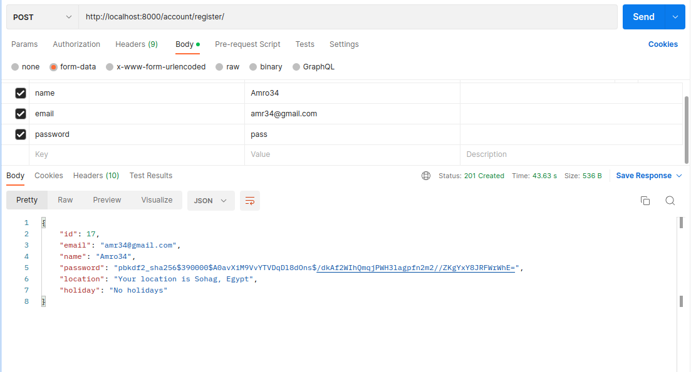
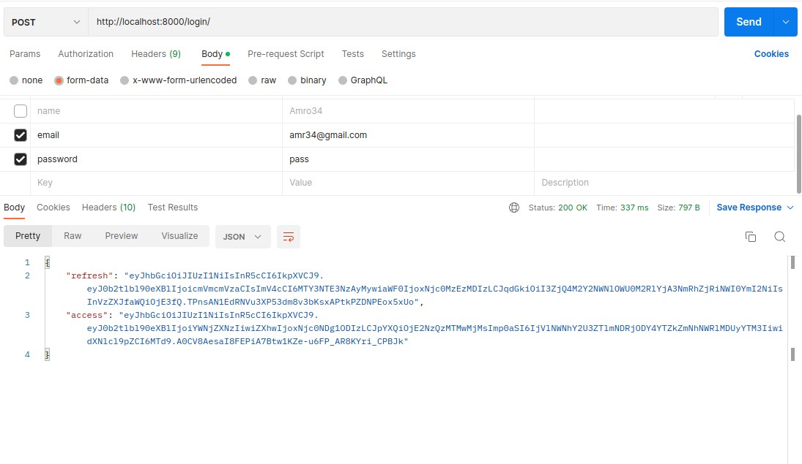
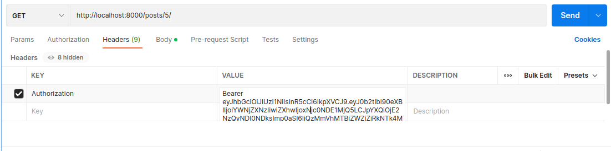
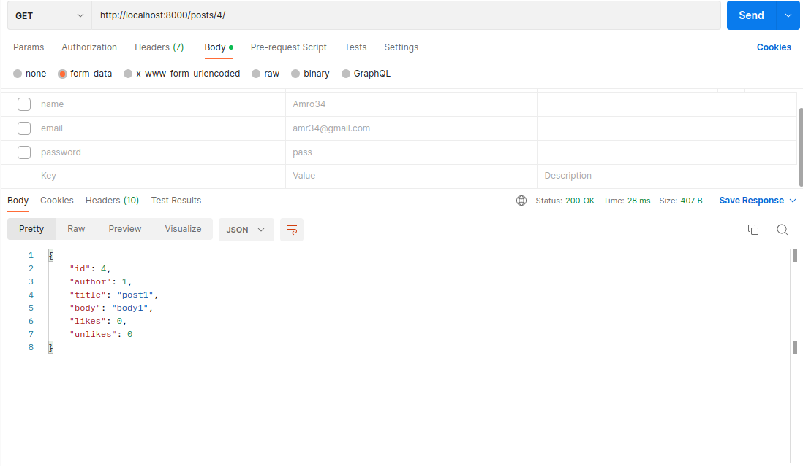
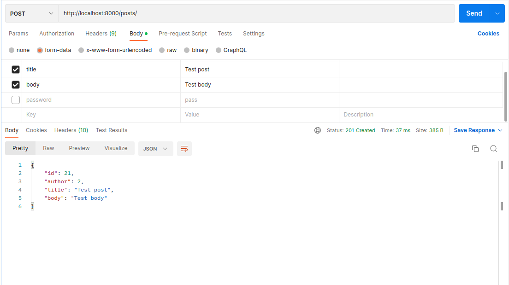
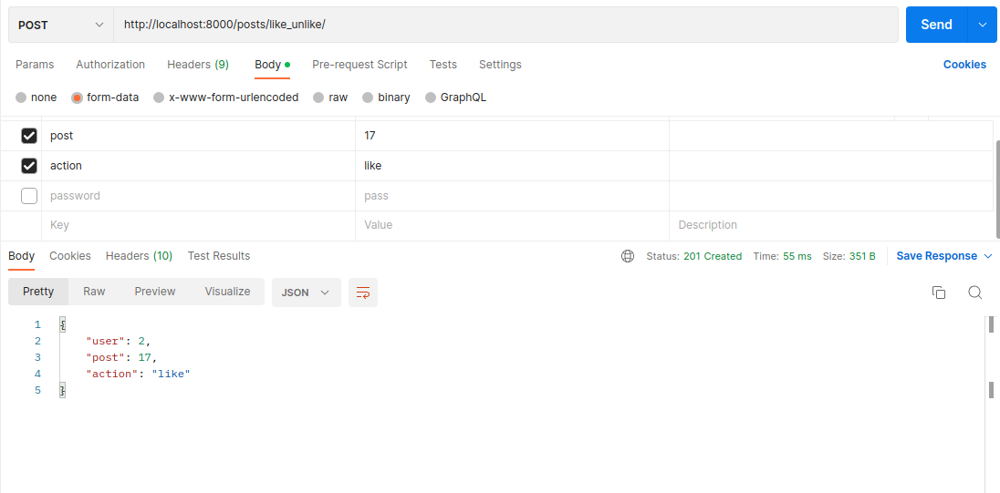

# Social Network API

A simple REST API-based social network in Django where Users can sign up and create text posts and view, like, and unlike other Users’ posts.

## Technoligies used

- Django
- Django rest framework
- PostgreSQL
- Simple JWT
- Celery
- Redis

## Installation

run the following in the shell

```
pip3 install -r requirements.txt
```

## Set up

In the project main directory, run the following commands in separate shells

### Set up the database

Inside your `postgres` shell, run the following commands

```
CREATE DATABASE socialnetwork;
```

```
CREATE USER socialnetworkuser WITH PASSWORD 'password';
```

```
GRANT ALL PRIVILEGES ON DATABASE socialnetwork TO socialnetworkuser;
```

```
ALTER USER socialnetworkuser CREATEDB;
```

### Run the server

In your shell, run the following commands

```
python3 manage.py runserver
```

```
redis-server
```

```
python3 -m celery -A social_network worker
```

## Endpoints

- Send POST request to `/account/register/` to sign a user up and get geolocation and holiday data
  
- Send GET request to `/account/users/<id>/` to get user data
  
- Send POST request to `/login/` to get the access token
  
- You must be authenticated/authorized to create/delete posts, you can authenticate by passing the token in the authorization header like so:
  
- Send GET request to `/posts/` to get the list of all posts
  
- Send GET request to `/posts/<id>/` to get details of a post with the number of likes/unlikes
  
- Send DELETE request to `/posts/<id>/` to delete the post (only the author can delete the post)
  
- Send POST request to `/posts/` to create a new post with the author of the current logged in user
  
- Send POST request to `/posts/like_unlike/` with id of the post and the action(like/unlike) in the request body to like/unlike the post
  

## Tests

run the following command to run the tests

```
python3 manage.py test
```
